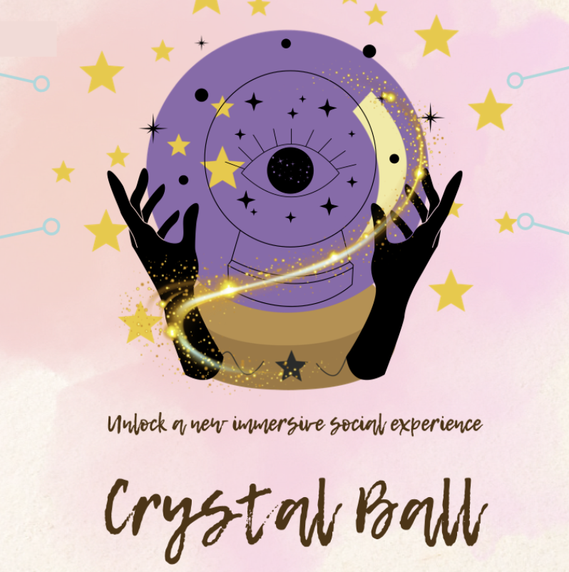

  

<h3 align="center">CrystalBall</h3>

---

This is the guidance on how to rebuild our project.

## 🌕 Table of Contents

- [About](#about)
- [Our Features](#our_features)
- [Getting Started](#getting_started)
- [Built Using](#built_using)
- [Authors](#authors)

## 🪄 About 

Welcome to CrystalBall! Our innovative project helps participants break the ice through story-driven role-playing. Each player influences the story development by choosing a role, and the story evolves in real time based on user input. GPT generates new plots based on the choices, ensuring that every interaction is unique and personalized.

## 🦋 Our Features 

- 💫 **Ice-Breaking**: Encourages natural interaction and conversation among participants through engaging storylines.
- 💫 **Collaboration**: Participants work together, making decisions that affect the progression of the story.
- 💫 **Innovation**: Unique, dynamic stories generated by GPT ensure that each session is different, providing a fresh experience every time. ()

## 🔮 Getting Started 

### ✨ Prerequisites
**Device Setup**:
   - Assemble each device with the required components, including the ESP32 microcontroller, LED lights, and buttons.
   - Set up the devices to represent different roles (Lia, Ivan, Sophia, and Leon).
   - Assign the correct device IDs to enable communication between them.

### ✨ Software Setup
**Installing Libraries**:
   - Ensure that the following Arduino libraries are installed:
     - `esp_now.h`
     - `WiFi.h`
     - `LiquidCrystal_I2C.h`
   - Upload the appropriate code to each ESP32 device, ensuring that they are configured with the correct role-specific settings.

## 🐜 Built Using 

- **Embedded Development** - ESP32 microcontroller (ESP32 dev module), LED lights, buttons, and other electronic components.
- **Arduino IDE** - Used for programming and configuring the ESP32 devices.

## 🔆 Authors 

- ✨ **Mingkun Li** - Hardware & Code
- ✨ **Jiaqi Zhang** - Script
- ✨ **Jue Ma** - Code of Script
